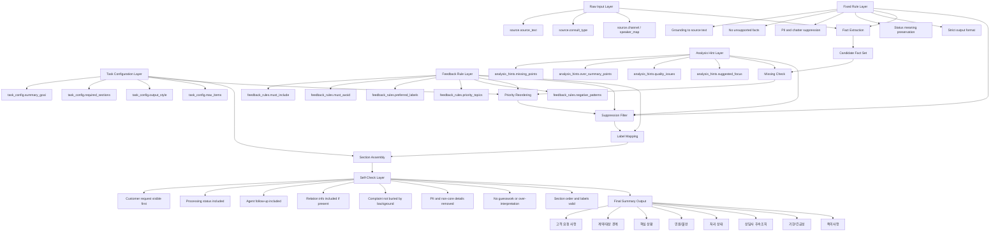
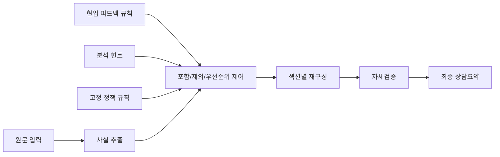

# Layered Summary Prompt Diagram

## Full Architecture

## Simplified Flow

## Layer Definition

1. Input Layer
   - `source`
   - `task_config`
   - `feedback_rules`
   - `analysis_hints`
2. Control Layer
   - grounding rules
   - inclusion rules
   - exclusion rules
   - priority rules
   - label rules
3. Composition Layer
   - fact extraction
   - missing check
   - reordering
   - filtering
   - section assembly
4. Validation Layer
   - self-check
   - format check
   - final output

## Summary

이 구조는 `원문`에서 사실을 추출하고, `현업 피드백`과 `분석 힌트`로 포함/제외/우선순위를 제어한 뒤, `자체검증`을 거쳐 고정된 실무 섹션으로 출력하는 레이어드 프롬프트 아키텍처다.
