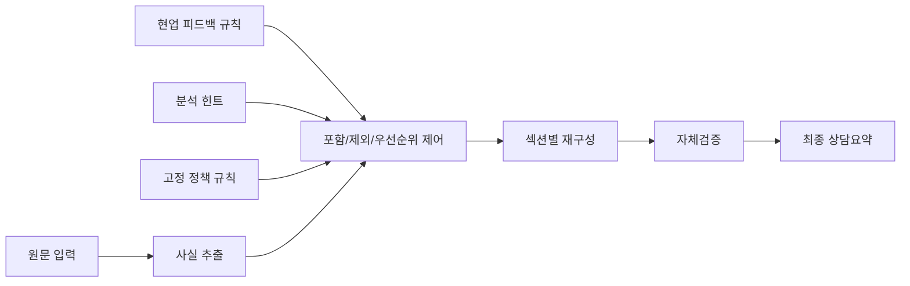

# 발표용 1장 설명

## 제목

Grounded Feedback-Aware Layered Summary Prompt

## 한 줄 정의

원문 기반 사실 추출 위에 현업 피드백 규칙과 분석 힌트를 레이어로 얹고, 마지막에 자체검증을 거쳐 실무형 요약으로 출력하는 구조다.

## 아키텍처 요약

## MVC/MVVM와의 관계

본 구조는 웹서비스의 MVC/MVVM처럼 역할과 변경 책임을 분리하는 사고방식을 참고했지만, 이를 그대로 가져온 것은 아니다.
UI 중심 패턴을 직접 이식한 것이 아니라, 프롬프트 실행 특성에 맞게 `Input / Rule / Composition / Validation` 레이어로 재구성한 아키텍처다.
즉, 개념적으로는 MVC/MVVM의 관심사 분리에 가깝고, 구현 관점에서는 `Rule-Based Prompt Pipeline`에 더 가깝다.

## 핵심 포인트

- 원문 근거성을 최우선으로 두기 때문에 hallucination을 억제한다.
- 현업 피드백을 프롬프트 문장에 누적하지 않고 규칙 데이터로 분리한다.
- 반복되는 누락과 과다 반영을 `analysis_hints`와 `feedback_rules`로 흡수한다.
- 출력 직전 `self-check`를 통해 누락, 과다, 순서 문제를 한 번 더 잡는다.

## 레이어 설명

1. Fixed Layer
   - 정책, 보안, 근거성, 출력 형식 같은 변하지 않는 규칙
2. Variable Layer
   - 상담 유형별 섹션, 요약 목적, 출력 스타일
3. Learning Layer
   - 현업 피드백, 반복 오류 패턴, 분석 힌트
4. Self-Check Layer
   - 고객 요청 선배치, 처리 상태, 후속조치, 관계 정보, 개인정보 제거 여부 점검

## 기대 효과

- 현업 검수 포인트를 사전에 구조화할 수 있다.
- 프롬프트 본문이 비대해지지 않는다.
- 모델이나 버전이 바뀌어도 운영 규칙을 비교적 안정적으로 유지할 수 있다.
- 요약 결과를 평가 기준과 직접 연결해 개선 루프를 만들기 쉽다.

## 실무 메시지

좋은 프롬프트를 길게 쓰는 것이 목적이 아니라, 현업 피드백이 들어와도 구조적으로 흡수되는 운영 체계를 만드는 것이 목적이다.
